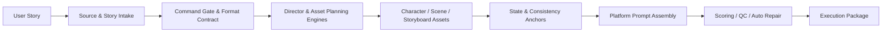

# AI Visual Director

<p align="center">
  <strong>Turn Stories into Production-Ready Visual Plans</strong>
</p>

<p align="center">
  From character and scene anchoring to storyboard design, video prompts, platform adaptation, and quality control.<br>
  A Prompt Production OS for AI films, short dramas, motion comics, and serialized content.
</p>

<p align="center">
  <a href="./README.md"><strong>English</strong></a>
  ·
  <a href="./README.zh-CN.md">中文</a>
  ·
  <a href="./docs/usage.md">User Guide</a>
  ·
  <a href="./docs/capabilities.md">Capability White Paper</a>
  ·
  <a href="./docs/system-architecture.md">System Architecture</a>
</p>

<p align="center">
  
  
  
</p>

---

> A story goes in; character sheets, scene references, storyboards, video prompts, and an execution package come out.
> This is not an inspiration toy. It is a visual production line with command gates, format contracts, state locking, asset separation, and multidimensional QC.

```text
Story
  → Intake
  → Director Decisions
  → Character & Scene Anchors
  → Storyboard
  → Platform Prompts
  → Quality Control
  → Execution Package
```

## Why It Exists

AI image and video models are already powerful, but production is about more than generating a single beautiful image:

- A character's face, costume, props, and posture drift between shots
- Scene geometry, lighting direction, and materials lose continuity
- Presentation boards, marketing art, and video references get mixed together and introduce noise
- Prompts grow longer after repeated revisions while creative boundaries become less clear
- Reference-image, first/last-frame, and text rules cannot be reused directly across video platforms

AI Visual Director encodes the director's workflow as an inspectable constraint system:

```text
Full capability preserved
→ Default authority constrained
→ Exploration explicitly triggered
→ State committed only after confirmation
→ Video assembled, never redesigned
```

## Core Capabilities

| Capability | Coverage |
|---|---|
| **53 visual styles** | Film, animation, Eastern aesthetics, science fiction, glitch art, and director-method references |
| **44 layout systems** | Full boards, character boards, scene boards, timelines, HUDs, vertical formats, and keyframe sequences |
| **140+ camera techniques** | Shot sizes, camera movements, angles, focal lengths, aspect ratios, transitions, and special POVs |
| **19 numbering systems** | Automatic mapping for style, emotion, color, expression, body language, environment, material, sound, and more |
| **8 character-consistency methods** | Character sheets, five-angle views, expression sets, costume and weapon details, DNA, and reference anchoring |
| **7 scene-consistency methods** | All-in-one boards, nine-grids, panoramas, blueprints, surround captures, and widescreen anchors |
| **5 video platforms** | Platform-specific prompts for Seedance, Runway, Kling, Luma, and Pika |
| **12 video QC checks** | Character, scene, lighting, props, action, transitions, subtitles, sound, and asset purpose |

## Start in 30 Seconds

### Install

```bash
npx ai-visual-director
```

You can also use the install script or install from source:

```bash
curl -fsSL https://raw.githubusercontent.com/jijiutong/ai-visual-director/main/install.sh | sh
```

```bash
git clone https://github.com/jijiutong/ai-visual-director.git
cd ai-visual-director
sh install.sh
```

Restart Claude Code, then enter:

```text
/create Two swordsmen face off before a Buddha statue in a rain-soaked temple. The master realizes his disciple has fallen to darkness, and both draw their swords. 15s, 7 shots.
```

The default is `/create standard`:

```text
Story intake → Shot budget → Character anchor → Scene anchor
→ Storyboard → Video prompt → QC → Execution checklist
```

See the [User Guide](./docs/usage.md) for the complete workflow.

## Choose Your Entry Point

| What you want to do | Command | Learn more |
|---|---|---|
| Generate a complete execution package from a story | `/create` | [One-click orchestration](./sub-skills/create/SKILL.md) |
| Read from Obsidian, Markdown, or pasted content | `/source` | [Input source system](./sources/README.md) |
| Lock character appearance and character DNA | `/character` | [Character workflow](./sub-skills/character/SKILL.md) |
| Lock scene geometry, materials, and lighting | `/scene` | [Scene workflow](./sub-skills/scene/SKILL.md) |
| Design shots, storyboards, and full boards | `/storyboard` | [Storyboard workflow](./sub-skills/storyboard/SKILL.md) |
| Assemble multi-platform video prompts | `/video` | [Video workflow](./sub-skills/video/SKILL.md) |
| Design dialogue, subtitles, and lip-sync rhythm | `/dialogue` | [Dialogue engine](./engines/dialogue-engine.md) |
| Design ambience, foley, music, and reverb | `/sound` | [Sound engine](./engines/sound-engine.md) |
| Explore styles, fusion, or director methods | `/style` | [Style workflow](./sub-skills/style/SKILL.md) |
| Generate a standalone marketing poster | `/poster` | [Poster workflow](./sub-skills/poster/SKILL.md) |

Governance commands: `/lock` · `/commit` · `/unlock` · `/check` · `/repair`

## Three Production Tiers

| Capability | `fast` | `standard` | `full` |
|---|:---:|:---:|:---:|
| Story intake and shot budget | ✓ | ✓ | ✓ |
| Character and scene anchoring | Inline DNA | Standard templates | Standard templates |
| Storyboard and video prompts | Condensed | Complete | Complete |
| Dialogue and sound design | - | On demand | ✓ |
| Full board and complete QC | - | ✓ | ✓ |
| Best for | Rapid validation | Production | Full delivery |

## How the System Stays Stable

The system uses a four-layer capability model. Creative capabilities remain available, but each layer has different default authority:

| Layer | Invocation policy | Responsibility |
|---|---|---|
| **Stable governance layer** | Always on | Routing, format contracts, lock state, prompt QC, and automatic repair |
| **Asset production layer** | Command-driven | Characters, scenes, storyboards, video, dialogue, sound, and posters |
| **Director enhancement layer** | Project mode | Shot budget, pacing, emotion curves, color narrative, and motion physics |
| **Exploratory layer** | Explicit trigger | Multiple versions, style fusion, migration, director methods, and series continuation |

State lifecycle:

```text
draft       Default draft; does not pollute primary state
  ↓
locked      Confirmed by the user; cannot be overwritten automatically
  ↓
committed   Persisted to formal project state
```

Learn more: [Capability Boundaries](./docs/capabilities.md) · [State Management](./state/README.md) · [Format Contract](./rules/format-contract.md)

## Architecture Overview



| Module | Role | Documentation |
|---|---|---|
| `SKILL.md` | Main routing, command boundaries, and execution contract | [Main skill](./SKILL.md) |
| `sources/` | Paste, Markdown, Obsidian, and frontmatter intake | [Input sources](./sources/README.md) |
| `engines/` | Routing, director decisions, planning, scoring, repair, and packaging | [Engine map](./engines/README.md) |
| `docs/` | User guide, capability white paper, architecture, and command reference | [Documentation center](./docs/README.md) |
| `state/` | State registry, asset mappings, shot snapshots, and project dependency graphs | [State management](./state/README.md) |
| `rules/` | Format, consistency, numbering, quality, and platform constraints | [Quality rules](./rules/qc.md) |
| `templates/` | Character, scene, storyboard, poster, and sound templates | [Template directory](./templates/README.md) |
| `knowledge/` | Camera, lighting, composition, material, performance, and sound knowledge bases | [Knowledge base](./knowledge/README.md) |
| `platforms/` | Image and video platform adaptation and API integration | [Platform adapters](./platforms/README.md) |
| `sub-skills/` | Independent user-facing command workflows | [Sub-skills](./sub-skills/README.md) |
| `imitation/` | Director and studio visual-method reference library | [Style references](./imitation/README.md) |
| `examples/` | Sample projects and reference outputs | [Examples](./examples/) |
| `projects/` | Persistence for films, series, and multi-segment projects | [Project system](./projects/README.md) |
| `.agents/` | Agent configuration directory | — |
| `.claude/` | Claude Code configuration directory | — |

For the complete data flow and file-placement rules, see [System Architecture](./docs/system-architecture.md).

## Documentation Center

| Document | Best for | What you get |
|---|---|---|
| [User Guide](./docs/usage.md) | First-time users and command lookup | Command selection, production tiers, common workflows, and state commits |
| [Capability White Paper](./docs/capabilities.md) | Understanding system boundaries | Four-layer model, asset purposes, defaults, and invocation conditions |
| [System Architecture](./docs/system-architecture.md) | Maintainers and contributors | Execution flow, module roles, directory structure, and extension principles |
| [Main Skill Contract](./SKILL.md) | Skill developers | Main routing, governance rules, module mapping, and global negatives |
| [Documentation Index](./docs/README.md) | Everyone | Quick navigation from tasks to authoritative documentation |

## Platform Coverage

| Image generation | Video generation |
|---|---|
| GPT Image · Midjourney · DALL-E · SDXL / SD3 | Seedance · Runway · Kling |
| Flux · Ideogram · Tongyi Wanxiang · Recraft | Luma · Pika · ComfyUI / IP-Adapter extensions |

See [Platform Adaptation](./platforms/README.md) for configuration and limitations.

## License

[MIT](./LICENSE)
